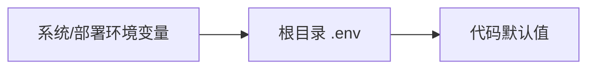
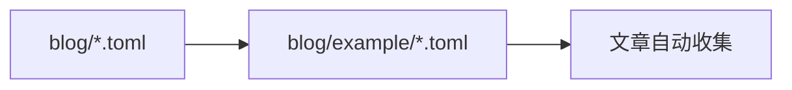

# 小鸽志静态博客开发说明

这是一个根目录即项目目录的 Astro 静态博客。`blog/` 是用户内容区，`src/` 是页面模板和功能实现。

## 目录结构

```text
./
├─ blog/
│  ├─ posts/                # 文章：每篇一个目录，包含 index.md 和 img/
│  ├─ pages/                # 自定义一级页面：每页一个目录，包含 index.md
│  ├─ example/              # 可提交的 TOML 模板，也作为默认 fallback
│  ├─ images/               # 公开图片资源：默认封面、默认 logo、默认头像；用户自定义图片默认不提交
│  ├─ menu.toml             # 本地导航菜单，默认不提交
│  ├─ categories.toml       # 本地分类显示信息，默认不提交
│  ├─ tags.toml             # 本地标签显示信息，默认不提交
│  └─ links.toml            # 本地友链数据，默认不提交
├─ src/
│  ├─ pages/                # Astro 路由入口
│  ├─ templates/            # 布局、组件、样式
│  ├─ features/             # 数据、SEO、文章、分类标签等功能
│  └─ content.config.ts     # Astro Content Collection 配置
├─ .env.example             # 站点基础环境变量示例；实际 .env 不提交
├─ astro.config.mjs
├─ package.json
└─ tsconfig.json
```

## 配置规则

站点基础信息只读环境变量，优先级如下：



内容配置使用 TOML，优先级如下：



| 文件 | 用途 | 读取方式 |
| --- | --- | --- |
| `blog/menu.toml` | 导航菜单 | 用户文件存在时整体替换 `blog/example/menu.toml` |
| `blog/links.toml` | 友链数据 | 用户文件存在时整体替换 `blog/example/links.toml` |
| `blog/categories.toml` | 分类名称和描述 | 只覆盖文章中已使用的同名 slug |
| `blog/tags.toml` | 标签名称 | 只覆盖文章中已使用的同名 slug |

分类和标签会先从文章 frontmatter 自动收集。TOML 中没有文章使用的分类或标签不会生成页面。

## TOML 示例

```toml
[[categories]]
slug = "website"
name = "建站"
description = "静态站、博客、域名、CDN 与 SEO 实践。"

[[tags]]
slug = "hello-world"
name = "hello-world"
```

```toml
[[menu]]
label = "首页"
href = "/"

[[menu]]
label = "关于"
href = "/about"
```

```toml
[[links]]
group = "Blog"
name = "Example"
url = "https://example.com"
desc = "示例站点"
icon = "https://example.com/icon.png"
```

## 文章结构简版

完整规则见 `文章内容结构要求.md`。

文章使用一篇一个目录：

```text
blog/posts/
└─ hello-world/
   ├─ index.md
   └─ img/
      ├─ cover.svg
      └─ hello-world-1.svg
```

frontmatter 示例：

```md
---
title: "Hello World"
slug: "hello-world"
description: "文章摘要。"
date: "2026-06-09"
categories:
  - website
tags:
  - hello-world
cover: "./img/cover.svg"
top: 0
comments: false
---
```

封面读取顺序：

1. frontmatter 中的 `cover`。
2. `img/cover.*`。
3. 根目录 `cover.*`。
4. `img/{slug}-1.*`。
5. `/default-cover.svg`。

默认封面文件位于 `blog/images/default-cover.svg`，构建后使用根路径 `/default-cover.svg` 访问。

## 页面结构简版

完整规则见 `页面结构需求.md`。

自定义页面放在 `blog/pages/{slug}/index.md`，只支持一级路径。文件夹名就是 URL：

```text
blog/pages/
└─ about/
   └─ index.md              # 生成 /about
```

页面 frontmatter 只需要：

```md
---
title: "关于"
description: "关于这个站点和内容方向。"
comments: false
---
```

页面正文可以使用 Markdown 和相对图片，例如 `./img/example.svg`。页面不要写 `slug`、`date`、`categories`、`tags`、`cover`、`top`；这些字段只属于文章。`comments` 字段先保留，不开发评论 UI。

## 环境变量

| 变量 | 用途 |
| --- | --- |
| `BLOG_TITLE` | 站点标题 |
| `BLOG_SUBTITLE` | 站点副标题 |
| `BLOG_DESCRIPTION` | SEO 描述 |
| `BLOG_URL` | 正式站点 URL；影响 sitemap、RSS、robots |
| `BLOG_LOGO` | logo 路径；未设置时自动读取 `/logo.*`，否则使用 `/default-logo.svg` |
| `BLOG_LOGO_DARK` | 深色模式 logo 路径；未设置时自动读取 `/logo-dark.*`，否则使用 `BLOG_LOGO` |
| `BLOG_SHOW_TITLE` | 是否显示站点标题 |
| `THEME_COLOR` | 主题主色调，必须是 3 位或 6 位十六进制颜色 |
| `BLOG_AUTHOR` | 作者名称 |
| `BLOG_AVATAR` | 作者头像；未设置或文件不存在时使用 `/default-user.svg` |
| `BLOG_AVATAR_CIRCLE` | 是否将作者头像裁成圆形；未设置或空值时开启 |
| `BLOG_BIO` | 作者简介 |

## 发布说明

1. `blog/*.toml`、`.env`、用户新增文章和页面默认不提交。
2. `blog/example/*.toml`、`blog/posts/hello-world/**`、`blog/pages/about/**` 是可提交示例。
3. `blog/images/` 是公开图片目录，构建后可直接用根路径访问；例如 `blog/images/banner.png` 使用 `/banner.png`。目录中仅 `default-cover.svg`、`default-logo.svg`、`default-user.svg` 提交到 Git，其余用户自定义图片默认不提交。
4. `dist/`、`.astro/`、`output/`、`.playwright-cli/` 是运行或构建产物，不提交。
5. `/robots.txt` 由 `src/pages/robots.txt.ts` 在构建时生成。

## 验收

1. `npm.cmd run build` 成功执行。
2. `/archives/hello-world`、`/categories/website`、`/tags/hello-world`、`/about` 可生成。
3. RSS、sitemap、robots 使用正确站点 URL。
4. Markdown 表格、代码块、引用、图片在桌面和移动端不撑破页面。
