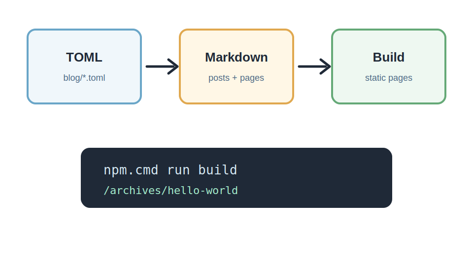

这是一篇占位文章，用来确认文章列表、详情页、分类页、标签页和 Markdown 样式都能正常工作。



## 基础段落

普通段落会保持合适的行高和阅读宽度。你可以在这里写项目记录、教程步骤、资源整理或个人笔记。

> 这是一段引用内容，适合放提示、摘录或需要强调的说明。

## 常见列表

无序列表：

- 站点配置使用 TOML。
- 站点信息优先使用环境变量。
- 分类和标签会从文章中自动收集。

有序列表：

1. 创建文章目录。
2. 编写 `index.md`。
3. 把图片放进 `img/`。
4. 运行构建命令检查结果。

## 代码块

行内代码示例：`npm.cmd run build`。

```ts
const message = 'hello-world';

console.log(`Current post: ${message}`);
```

## 表格

| 项目 | 示例 |
| --- | --- |
| 分类 | `website` |
| 标签 | `hello-world` |
| 封面 | `./img/cover.webp` |

## 链接和分隔线

可以链接到 [Astro 官网](https://astro.build/) 或站内页面。

---

这篇文章是兜底示例内容。后续在 `blog/posts/` 添加真实文章后，示例文章会自动隐藏。
